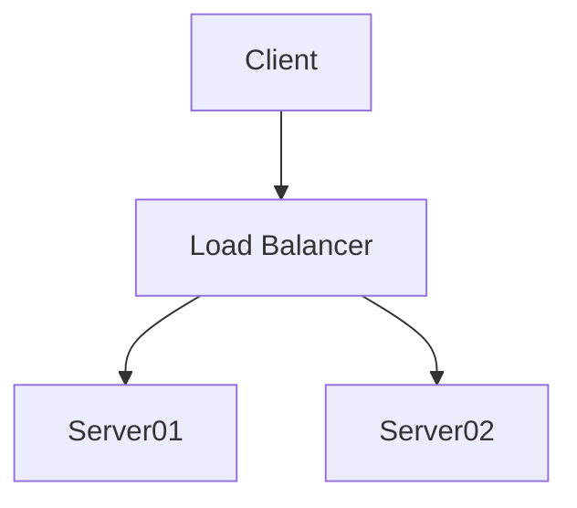

# Function as a Container

## About

A library of lightweight docker images which exist to perform a wide-array of simple function (or a group of similar functions).

## Usage

These images can be used in a variety of ways.

- [x] CI/CD Executors
- [x] Installation-free application
- [x] Modular Dockerfile building
- [x] Pre-Commit Hooks

### CI/CD Executors

This ones pretty straightforward, just specify the desired image in a pipeline step.

### Installation-free Application

Using `docker cp`, it's possible to install binaries from containers to the host OS. For security reasons, you probably want to install them directly from source, but it is possible.

### Modular Dockerfile Building

One of the awesome aspects of docker image building, is being able to borrow layers from existing containers, as it doesn't add unneccesary bloat to overall image size. In fact, more than few layers in this collection are borrowed from other images.

!!! note
Functions which can be utilized as a dependency-free layer in Dockerfiles are preferred, but some inevitably have dependencies and can't be utilized as standalone layers

### Pre-Commit Hooks

!!! warning
Currently under development, and not much functionality yet.

I like pre-commit hooks, but hate installing lots of dependencies. This repository comes with a pre-commit hook library whoch has just one dependency, docker.

## Integration with my other projects

This repository is tightly integrated with two of my other repositories.

### Modular GitLab-CI

A collection of stackable, extendable templates for use in GitLab-CI. Those templates utilize these images as their runners.

- [:fontawesome-brands-gitlab: GitLab](https://gitlab.com/donaldrich/modular-gitlab-ci)

- [:octicons-book-16: Docs](https://donaldrich.gitlab.io/modular-gitlab-ci)

### CICDevs

Docker images intended as function runners in CI/CD pipelines, but also designed and documented to allow easy use for in-container development, testing, sandbox, etc.

- [:fontawesome-brands-gitlab: GitLab](https://gitlab.com/donaldrich/cicdevs)

- [:octicons-book-16: Docs](https://donaldrich.gitlab.io/cicdevs)

## Layering

## Files

??? info "File Tree"

    ```sh
    --8<--
    layout.md
    --8<--
    ```


